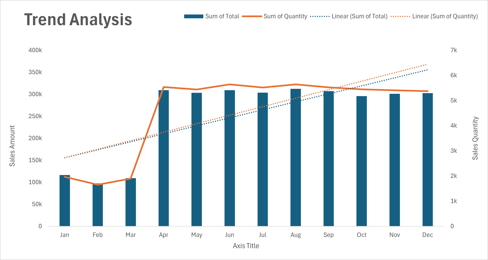
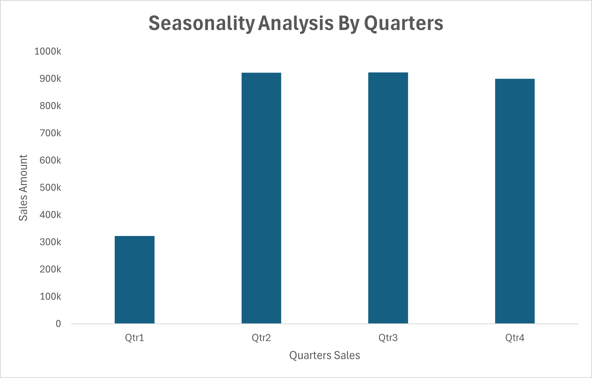
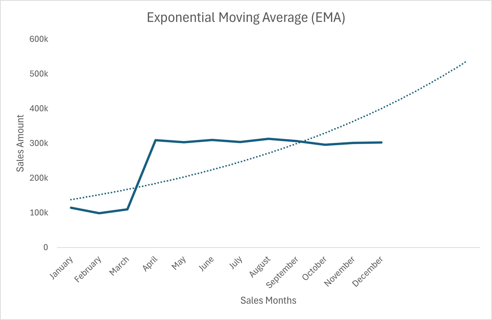
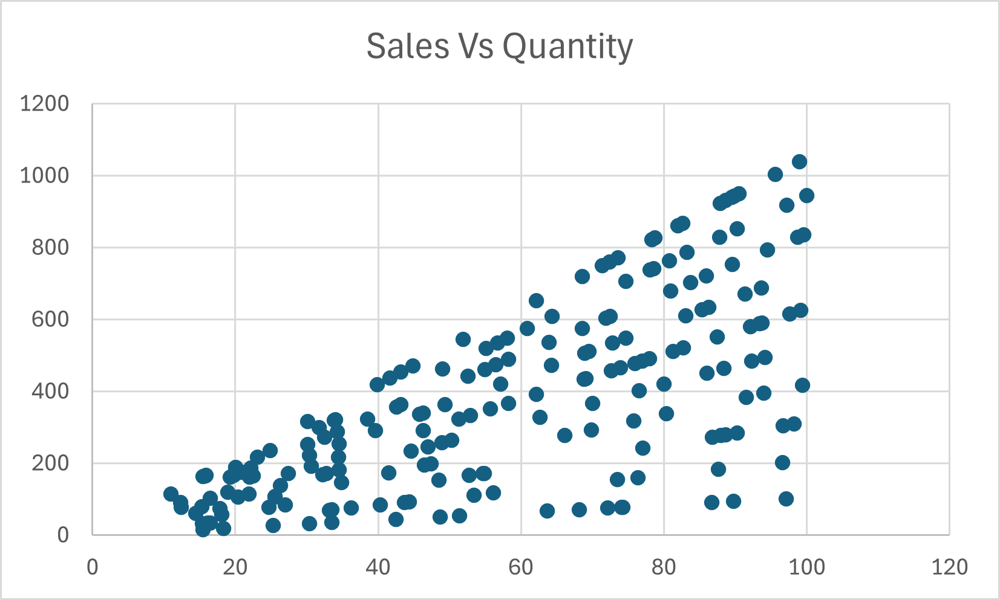
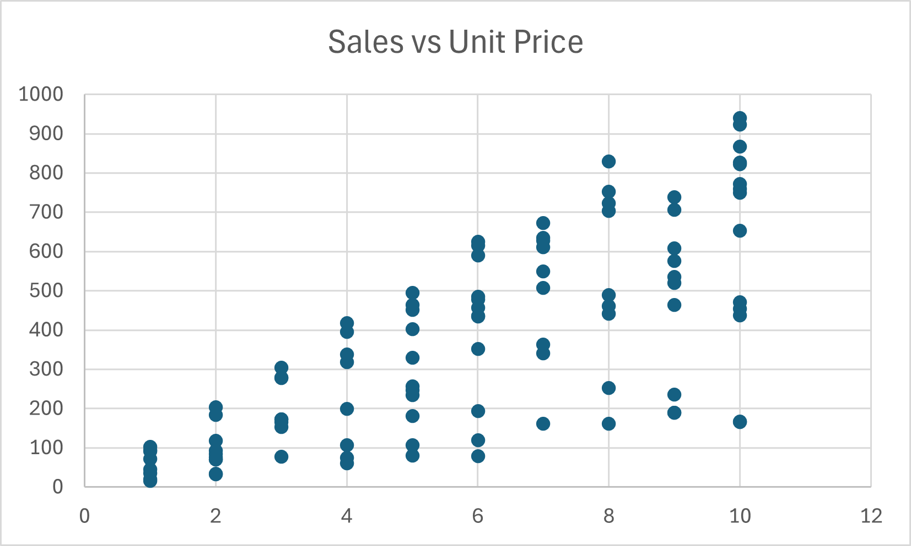
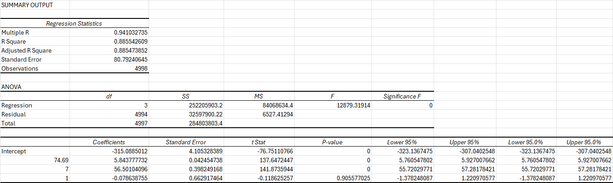
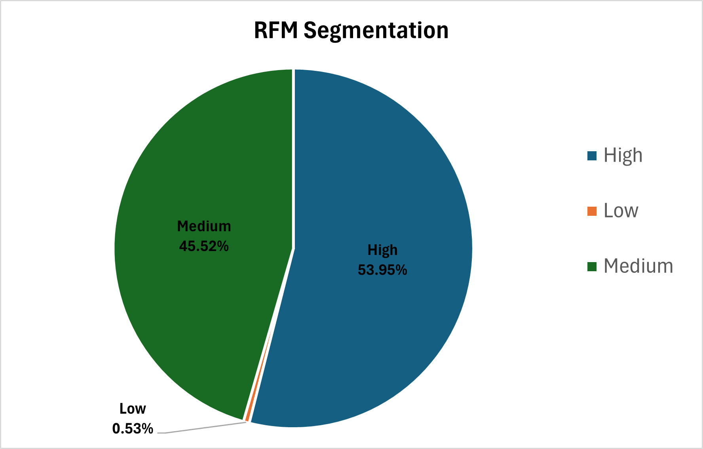
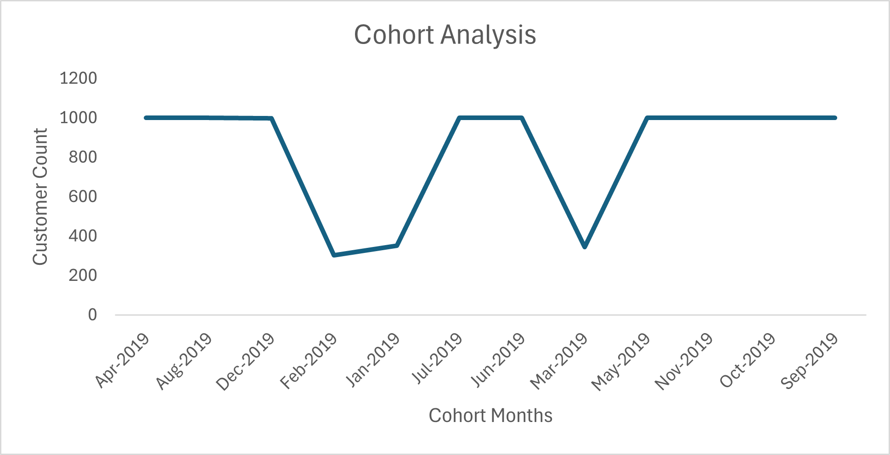
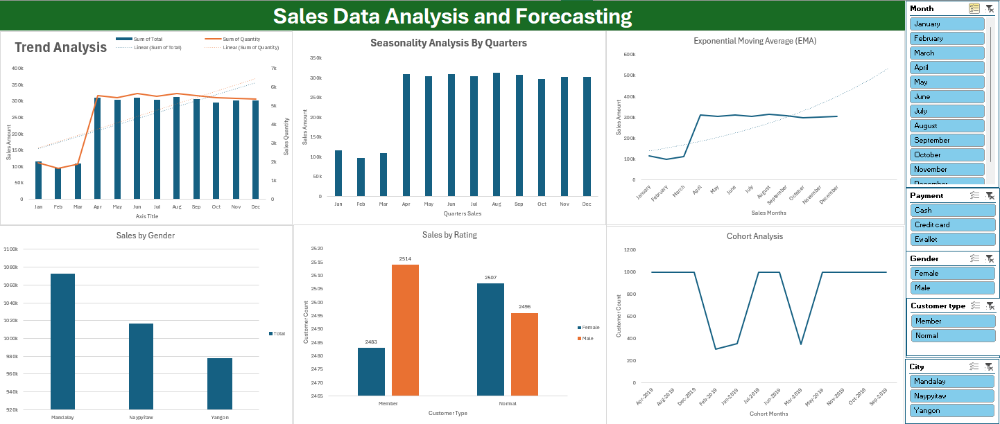

# Sales Data Analysis and Forecasting Using Excel

This project demonstrates the process of sales data analysis and forecasting using Microsoft Excel. The goal of this project is to analyze historical sales data, identify trends and seasonal patterns, and apply time series forecasting techniques to predict future sales.

## Project Overview

**Objective:** 

Analyzing historical sales data, identify trends, seasonality, and key drivers of sales, and apply forecasting techniques to predict future sales. The goal is to use the data to provide actionable insights and optimize business strategies.

## Data Collection and Preparation

>
> * **Importing Data**
>   * Loading the sales dataset CSV into Excel.
>     * Ensuring proper data formatting (date, numbers, text).
> * **Data Cleaning**
>   * Removing any duplicates and handle missing values (fill or remove).
>     * Converting columns to appropriate data types (dates, numbers).
> * **Data Transformation**
>   * Creating new columns:
>     * Year, Month, Day of Week (derived from Date column).
>     * Sales per Transaction = Total / Quantity.

**The data is ready for further analysis or forecasting. We have cleaned the dataset, transformed it into a more useful format, and added calculated columns for deeper insights.**

## Time Series Analysis

> * **Trend Analysis**
>   * Plot sales data (Total) over time to identify trends.
>   * Applying linear regression to find an overall trend in the data.
> * **Seasonality Analysis**
>   * Using Pivot Tables to break down sales by Month.
>   * Detecting seasonal patterns.
> * **Moving Averages and Smoothing**
>   * Applying Simple Moving Average (SMA) and Exponential Moving Average (EMA) to smooth sales data.
>   * Using Exponential Smoothing (FORECAST.ETS) for trend and seasonality adjustments.

**Summary:**

The chart shows a significant spike in sales amount and quantity in April, followed by steady growth in quantity sold but a flattening of sales revenue in the following months.

**Key Insights:**

> * April spike likely due to promotions or seasonality, driving both sales quantity and revenue up.
> * **Sales quantity** is growing steadily, but revenue growth has plateaued post-April, suggesting potential pricing or margin issues.
> * Focus on replicating April’s success and enhancing revenue per unit by adjusting pricing or product strategies.

**Summary:**

The chart shows the sales amount across four quarters. Qtr1 has the lowest sales, while Qtr2, Qtr3, and Qtr4 show similar and higher sales figures.

**Key Insights:**

> * **Qtr1** has significantly lower sales, suggesting a potential off-season or lower demand in the first quarter.
> * **Qtr2**, **Qtr3**, and **Qtr4** have similar, higher sales, indicating stronger seasonal demand or consistent performance across these quarters.
> * Strategies should focus on boosting sales during **Qtr1**, leveraging insights from the stronger quarters.

**Summary:**

The chart shows Sales Amount over the months with an Exponential Moving Average (EMA) trendline. The EMA highlights the overall upward trend in sales, particularly after April.

**Key Insights:**

> * **Sharp Increase in Sales:** A significant spike in sales occurs in April, which is reflected in both the actual sales and the smoothed EMA.
> * **EMA Trendline:** The EMA line shows a steady upward trajectory, indicating a general increase in sales over the months.
> * **Post-April Growth:** After April, sales appear to maintain higher levels, suggesting sustained growth throughout the rest of the year.

## Key Driver Analysis

> * **Correlation Analysis**
>   * Performing correlation analysis to identify significant drivers of sales (`Unit price`, `Quantity sold`, `Product line`).
>   * Using scatter plots and correlation matrices to visualize relationships.
> * **Regression Analysis**
>   * Performing multiple regression analysis to model the relationship between sales and key variables (`Unit price`, `Quantity`, `Product line`, `Customer type`).
>   * Using Stepwise Regression for automatic selection of significant variables.
> * **Elasticity Analysis**
>   * Performing price elasticity analysis to measure how price changes affect sales.

### Correlation Analysis

**Summary:**

> * **Sales vs Product Line:** No strong relationship between sales and product line, as shown by the scattered data points.
> * **Sales vs Quantity:** A positive correlation exists, with sales increasing as quantity sold rises.
> * **Sales vs Unit Price:** There is a noticeable increase in sales as unit price increases, indicating that higher-priced items tend to generate higher sales.

**Key Insights:**

> * **Sales and Product Line:** Sales do not significantly vary by product line, suggesting other factors (like price or quantity) may drive sales.
> * **Quantity and Sales:** The strong positive relationship between sales and quantity indicates that increasing the quantity sold directly boosts total sales.
> * **Price and Sales:** The positive correlation between sales and unit price suggests that higher-priced products contribute to higher sales amounts.

### Regression Analysis

**Summary:**

>
> * R-squared of `0.8855` indicates that `88.55%` of the variability in the dependent variable is explained by the model, suggesting a strong fit.
> * Adjusted R-squared `(0.8855)` is similar to R-squared, indicating no overfitting.
> * The F-statistic is `12879.32`, and Significance F is `0`, indicating the model is statistically significant.
> * The coefficients show the influence of each variable:
>   * `Intercept: -315.09`.
>   * `Unit price (74.69):` 
>     * Strong positive effect on the dependent variable.
>   * `Quantity (7)`: 
>     * Strong positive effect.
>   * `Product Line (1)`: 
>     * No significant effect on the dependent variable, as its p-value is high `(0.905)`.

**Key Insights:**
>
> * **Strong Model Fit:** The model explains a large portion of the variance in the dependent variable `(88.55%)`.
> * **Statistical Significance:** The regression model is statistically significant, confirming its validity.
> * **Key Drivers:** Unit price and Quantity significantly affect the dependent variable, while Product Line has a minimal effect.

## Customer Segmentation and Behavioral Insights

> * **RFM Analysis (Recency, Frequency, Monetary)**
>   * Segment customers based on their purchasing behavior (Recency, Frequency, and Monetary values).
>   * Identify high-value customers and retention opportunities.
> * **Cohort Analysis**
>   * Group customers based on their first purchase date and track their buying behavior over time.
>   * Analyze customer retention rates and identify patterns.

### RFM Analysis (Recency, Frequency, Monetary)

**Summary:**

> * The **`RFM Segmentation`** chart shows customer segmentation based on **`Recency`**, **`Frequency`**, and **`Monetary`** values.
> * **`53.95%`** of customers are categorized as High, **`45.52%`** as Medium, and **`0.53%`** as Low.

**Insights:**

> * **Majority of Customers:** Most customers fall into the High or Medium segments, indicating strong customer engagement and valuable buyers.
> * **Low-Value Segment:** Only a small portion (0.53%) of customers are categorized as Low, which suggests there’s a very small percentage of customers with poor recency, frequency, and spending.
> * **Retention Opportunities:** Focus on retaining High and Medium segment customers with loyalty programs and personalized offers. Strategies should target increasing recency and frequency to move Medium customers to High.

### Cohort Analysis

**Summary:**

The `Cohort Analysis` chart tracks `customer counts` by their `first purchase month`. The customer count fluctuates significantly, showing peaks and valleys across different months in `2019`.

**Insights:**

> * **Seasonal Variation:** There are noticeable fluctuations in `customer count`, with peaks in `April`, `July`, and `October`.
> * **Retention or Acquisition Peaks:** The spikes in customer count could indicate periods of high customer acquisition or retention, possibly due to promotions or seasonal factors.
> * **Customer Engagement:** Analyzing why some months have low customer counts, such as `February` and `November`, could help identify gaps in customer engagement or market conditions that need to be addressed.

## Documentation and Insights

### Assumptions and Methodology

**Assumptions:**

> * **Seasonality:** The sales data is expected to exhibit seasonality, with higher sales during certain periods, particularly in `April`, `July`, and `October` based on historical trends.
> * **Growth Rates:** Assumed a steady growth in sales due to increasing customer engagement and retention, although growth rates may fluctuate depending on marketing, promotions, and seasonal factors.
> * **Product Price Influence:** `Unit price` has a significant impact on `sales`, as evidenced by the positive correlation between `sales` and `unit price`.

**Methodologies Used:**

> * **RFM Analysis:** Used to segment customers based on `Recency`, `Frequency`, and `Monetary` values to identify high-value customers and target retention strategies.
> * **Time Series Forecasting:** Used Exponential Smoothing `(FORECAST.ETS)` and Moving Averages `(SMA, EMA)` to account for seasonality and trends in the data for accurate future sales forecasting.
> * **Regression Analysis:** Performed multiple regression to understand the relationship between sales and key variables like `Unit Price`, `Quantity`, and `Product Line`.
> * **Cohort Analysis:** Segmented customers based on their `first purchase date` and tracked their buying behavior over time to analyze customer retention.

### Limitations

> * **Data Quality:**
> * Some missing data or outliers could impact the accuracy of trends and forecasts.
> * Sales data does not account for factors like marketing spend, advertising campaigns, or economic changes that might impact customer behavior.
> * **Seasonality Variations:**
> * While seasonality is assumed, the model does not account for potential unexpected external events `(e.g., pandemics, economic crises)` that could disrupt typical sales patterns.
> * **Customer Segmentation:**
> * `RFM Segmentation` is based on historical data, and future behavior may change. For instance, customers from Low or Medium segments might shift to High if new retention strategies are applied.

### Actionable Insights and Recommendations

> **1. Sales Performance:**
>
> * **Replicate Success:** Focus on replicating the April spike in sales by `enhancing promotions`, `marketing strategies`, or `discount offers` around similar seasonal peaks.
> * **Focus on Qtr1:** Given the lower sales in `Qtr1`, consider targeted marketing campaigns during early quarters to boost sales and customer engagement.
>
> **2. Pricing Strategies:**
>
> * The positive correlation between `price` and `sales` suggests that experimenting with premium pricing for certain `high-demand` products could improve sales.
> * Dynamic pricing strategies should be tested to maximize revenue during peak seasons.
>
> **3. Customer Retention:**
>
> * **Retention Programs for High and Medium Segments:** Since the majority of customers fall into the `High` and `Medium` segments, focus on loyalty programs and personalized offers to retain these valuable customers.
> * **Increase Engagement for Low-Value Customers:** Devise strategies to re-engage Low-segment customers by offering discounts or incentivize them to buy more frequently.
>
> **4. Inventory Management:**
>
> * Ensure that inventory levels are aligned with predicted `sales trends`, especially during peak months like `April`, `July`, and `October`, to avoid stockouts or overstocking.

### Review and Refinement

> **Validation of Models:** 
>
> * All calculations, assumptions, and forecasts should be reviewed against actual sales data to ensure accuracy.
>
> **Reassess Trends:**
>
> * Continue monitoring the seasonality and growth patterns to refine forecasting models and adjust assumptions if needed.

### Executive Summary

> **Key Findings:**
>
> * Sales data shows significant seasonality, with major peaks in `April`, `July`, and `October`.
> * Quantity sold and unit price are the main drivers of sales, while product line shows minimal impact on overall sales.
> * High-value customers dominate the sales performance, but opportunities exist to improve customer retention and engagement.
>
> **Forecast:**
>
> * Sales are expected to continue increasing in the coming months, especially with the integration of `Exponential Smoothing (EMA)` for forecasting.
>
> **Strategic Recommendations:**
>
> * Focus on boosting `Qtr1` sales with targeted marketing campaigns.
> * Implement dynamic pricing strategies to capitalize on high-demand periods.
> * Invest in customer retention programs to reduce churn and increase the value of Medium and Low customers.

### Stakeholder Presentation

